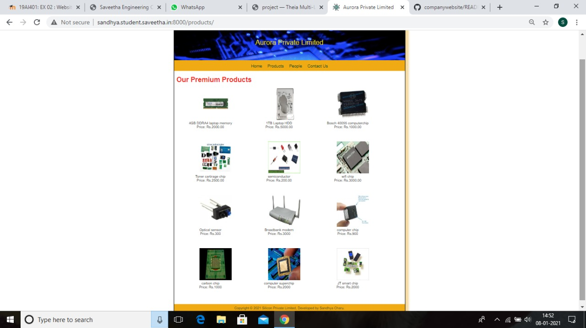
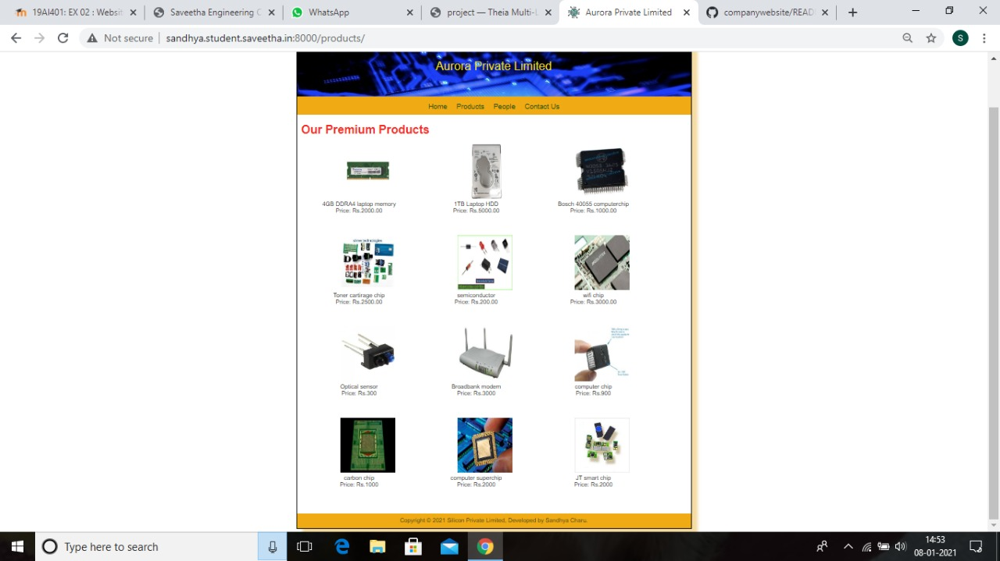

# Web Design for a Manufacturing Company
## AIM: 
To design a static website for a chip manufacturing company.

## DESIGN STEPS:
### Step 1: 
Requirement collection.
### Step 2:
Creating the layout using HTML and CSS.
### Step 3:
Updating the sample content.
### Step 4:
Choose the appropriate style and color scheme.
### Step 5:
Validate the layout in various browsers.
### Step 6:
Validate the HTML code.
### Step 6:
Publish the website in the given URL.

## PROGRAM:

### base.html
```

<!DOCTYPE html>
<html lang="en">

<head>
    <title>Aurora Private Limited</title>
    <link rel="stylesheet" href="">
    <link rel = "icon" href ="" type = "image/x-icon"> 
              
</head>

<body>
    <div class="container">
    <div class="banner">
        Aurora Private Limited
    </div>
    <div class="menu">
        <div class="menuitem"><a href="/home">Home</a></div> 
        <div class="menuitem"><a href="/products">Products</a></div> 
        <div class="menuitem"><a href="/people">People</a></div>
        <div class="menuitem"><a href="/contactus">Contact Us</a></div> 
    </div><div class="content">
     
    
    
    
    </div>
    <div class="footer">
        Copyright © 2021 Silicon Private Limited, Developed by Sandhya Charu.
    </div>
    </div>
</body>

</html>
```

### home.html
```
% extends "website/base.html" %}


    <div class="homecontent">    
    <h1><div class="about">About Us </div></h1>
    
    <div class="contenttext">
    Aurora Pvt Ltd, provides a broad range of semiconductor and infrastructure software applications that serve the data center, networking, software, broadband, wireless, and storage and industrial markets. Common applications for its products include: data center networking, home connectivity, broadband access, telecommunications equipment, smartphones, base stations, data center servers and storage, factory automation, power generation and alternative energy systems, displays, and mainframe operations and management, and application software development. Some of Silicon's core technologies and products include:
    <ul>
        <li>Memory Chips</li>
        <li>SATA HDD</li>
        <li>SATA SSD </li>
        <li>Broadband Modems</li>
        <li>Wifi Devices</li>
        <li>Switching Devices</li>
        <li>Optical Sensors</li>
    </ul> 
    </div>
    </div>



### products.html
```



<div class="productcontent">
  
    <h1><div class="about">Our Premium Products</div></h1>
   
    <div class="productitems">
        <div class="productitem">
           
            <div class="itemimage">
                
            </div>

            <div class="itemname">4GB DDRA4 laptop memory</div>
            <div class="itemprice">Price: Rs.2000.00 </div>
        </div>

        <div class="productitem">
            <div class="itemimage">
                
            </div>
            <div class="itemname">1TB Laptop HDD</div>
            <div class="itemprice">Price: Rs.5000.00 </div>
        </div>
        <div class="productitem">
            <div class="itemimage">
                
            </div>
            <div class="itemname">Bosch 40055 computerchip</div>
            <div class="itemprice">Price: Rs.1000.00 </div>
        </div>

        <div class="productitem">
            <div class="itemimage">
                
            </div>
            <div class="itemname">Toner cartirage chip </div>
            <div class="itemprice">Price: Rs.2500.00 </div>
        </div>

        <div class="productitem">
            <div class="itemimage">
                
            </div>
            <div class="itemname">semiconductor</div>
            <div class="itemprice">Price: Rs.200.00 </div>
        </div>

        <div class="productitem">
            <div class="itemimage">
                
            </div>
            <div class="itemname">wifi chip</div>
            <div class="itemprice">Price: Rs.3000.00 </div>
        </div>

        <div class="productitem">
            <div class="itemimage">
                
            </div>
            <div class="itemname">Optical sensor</div>
            <div class="itemprice">Price: Rs.300 </div>
        </div>

        <div class="productitem">
            <div class="itemimage">
                
            </div>
            <div class="itemname">Broadbank modem</div>
            <div class="itemprice">Price: Rs.3000 </div>
        </div>

        <div class="productitem">
            <div class="itemimage">
                
            </div>
            <div class="itemname">computer chip</div>
            <div class="itemprice">Price: Rs.900 </div>
        </div>

        <div class="productitem">
            <div class="itemimage">
                
            </div>
            <div class="itemname">carbon chip</div>
            <div class="itemprice">Price: Rs.1000 </div>
        </div>

        <div class="productitem">
            <div class="itemimage">
                
            </div>
            <div class="itemname">computer superchip</div>
            <div class="itemprice">Price: Rs.2000 </div>
        </div>

        <div class="productitem">
            <div class="itemimage">
                
            </div>
            <div class="itemname">JT smart chip </div>
            <div class="itemprice">Price: Rs.2000 </div>
        </div>
    </div>
</div>

```


###people.html
```


<div class="peoplecontent">
    <h1><div class="about">Our Executive Workers</div></h1>
    <div class="peoples">
        <div class="people">
            <div class="peopleimage">
                
            </div>
            <div class="peoplename">Sandhya charu N</div>
            <div class="peoplepos"> Holder </div>
        </div>
        <div class="people">
            <div class="peopleimage">
                
            </div>
            <div class="peoplename">Avinas R</div>
            <div class="peoplepos">Chief Executive Officer </div>
        </div>
        <div class="people">
            <div class="peopleimage">
                
            </div>
            <div class="peoplename">Natramil Selvam R</div>
            <div class="peoplepos">Manager </div>
        </div>
        <div class="people">
            <div class="peopleimage">
                
            </div>
            <div class="peoplename"> Bharathi N </div>
            <div class="peoplepos"> Assistant Manager </div>
        </div>
        <div class="people">
            <div class="peopleimage">
                
            </div>
            <div class="peoplename">Vijayalaxmi E</div>
            <div class="peoplepos"> Marketing Manager </div>
        </div>
        <div class="people">
            <div class="peopleimage">
                
            </div>
            <div class="peoplename">Parvathi R</div>
            <div class="peoplepos">Assistant Marketing Manager </div>
        </div>
    </div>
</div>


```
###contactus.html

```




<!DOCTYPE html>
<html lang="en">
     
    <title> CONTACT ADDRESS </title>
    <head>
        <div class="contact">
            <div class="contactimage">
                
            </div>
        </div>
        <h1><div class="items2">CONTACT ADDRESS </div></h1>
         <h2><div class="items"> Aurora private limited</div> 
         <div class="items"> barathiyar street,</div>
        <div class="items"> anna nagar chennai-600026</div></h2>
    </head>
    <body>
        <h2><div class="items1">phone no: 8764726374/7364672834</div><br>
       <div class="items"> fax: +91 044 2826 6708</div><br>
       <div class="items1"> email address:aurora@gmail.com<div></h2>
    </body>
</html>




```

## OUTPUT:





## CODE VALIDATION REPORT:


## RESULT:
Thus a website is designed for the chip manufacturing company and is hosted in the URL http://sandhya.student.saveetha.in:8000/. HTML code is validated.
